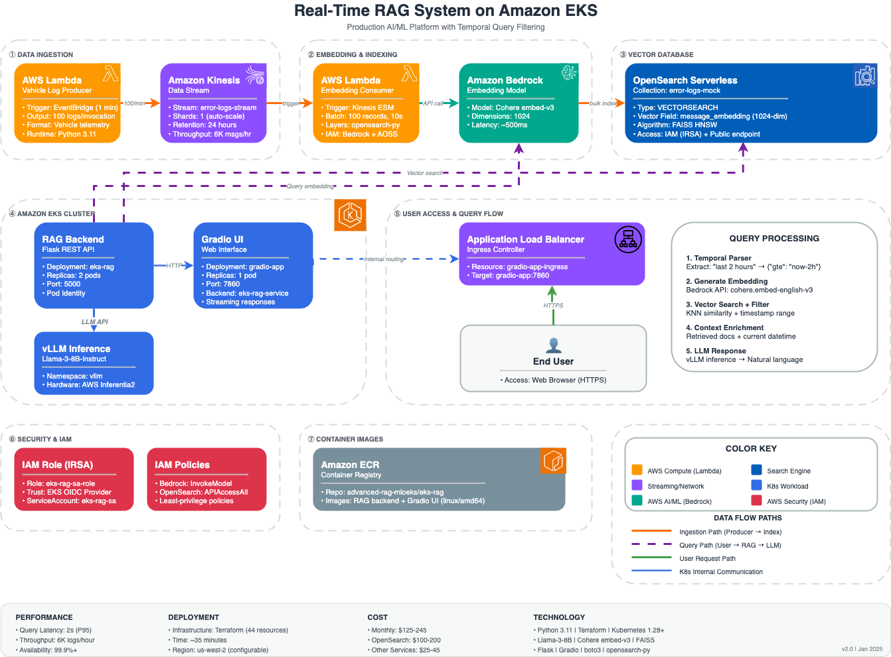

# Real-Time RAG System on Amazon EKS

Reference blueprint for AI/ML platform combining real-time data pipelines, vector search, and LLM inference on Amazon EKS with temporal query filtering.

## Table of Contents
- [System Architecture](#system-architecture)
- [Key Features](#key-features)
- [Prerequisites](#prerequisites)
- [Quick Start](#quick-start)
- [Usage Examples](#usage-examples)
- [Cost Estimation](#cost-estimation)
- [Security](#security)
- [Cleanup](#cleanup)

---

## System Architecture



### Data Flow

**Ingestion Pipeline:**
1. **Lambda Producer** generates 100 vehicle telemetry logs/minute → **Kinesis Stream**
2. **Lambda Consumer** processes stream → **Bedrock** embeddings (Cohere v3) → **OpenSearch Serverless**

**Query Pipeline:**
3. **User** submits query via **Gradio UI** (ALB)
4. **RAG Backend** parses temporal filters → generates embeddings → **vector search** with date filtering
5. **vLLM** (Llama-3-8B on Inferentia2) generates context-aware responses

---

## Key Features

### 🚀 Real-Time Data Pipeline
- **100 logs/minute** with current timestamps and rich telemetry
- **Zero indexing failures** with robust error handling
- **Kinesis streaming** with 24-hour retention

### 🔍 Advanced Vector Search
- **1024-dimensional embeddings** (Cohere embed-english-v3)
- **FAISS HNSW** engine for sub-second similarity search
- **Temporal filtering**: "last N hours/days/weeks/months"
- **Hybrid queries**: Vector similarity + timestamp range filters

### 🤖 LLM Integration
- **vLLM on Inferentia2** for optimized inference
- **Context-aware** responses with current UTC time
- **RAG pipeline** retrieves relevant context before generation

### 🛡️ Security Features
- **Pod Identity** for secure AWS service access
- **Network Policies** for pod egress control
- **AWS4Auth** with credential refresh
- **Encryption** at rest and in transit

---

## Prerequisites

### Required Infrastructure
- **EKS Cluster** (>= 1.28) with Pod Identity enabled
- **vLLM Service** running on Inferentia2 in `vllm` namespace
- **AWS Load Balancer Controller** installed

### Required Tools
- Terraform >= 1.5.0
- AWS CLI >= 2.x
- kubectl >= 1.28
- Docker >= 24.x (with `--platform linux/amd64` support)

### AWS Permissions
Your credentials need access to: IAM, EKS, OpenSearch Serverless, ECR, Kinesis, Lambda, Bedrock

---

## Quick Start

### 1. Verify Prerequisites

```bash
# Verify EKS cluster access
kubectl config current-context
kubectl get nodes

# Verify vLLM service
kubectl get svc -n vllm vllm-llama3-inf2-serve-svc

# Verify AWS Load Balancer Controller
kubectl get deployment -n kube-system aws-load-balancer-controller

# Check Bedrock access
aws bedrock list-foundation-models --region us-west-2 \
  --query 'modelSummaries[?contains(modelId, `cohere.embed`)].modelId'
```

### 2. Configure and Deploy

```bash
# Navigate to terraform directory
cd eks-rag/terraform

# (Optional) Customize configuration
cp terraform.tfvars.example terraform.tfvars
vim terraform.tfvars

# Initialize and deploy
terraform init
terraform plan
terraform apply
```

**Deployment time:** ~35 minutes

**Resources created:** 46 (ECR repos, OpenSearch collection, IAM roles, Lambda functions, Kubernetes resources, ALB)

### 3. Access the Application

```bash
# Get UI URL
terraform output ui_url

# Or watch ALB provisioning
kubectl get ingress gradio-app-ingress -w
```

Open the URL in your browser and start querying!

### 4. Verify Data Pipeline

```bash
# Monitor Lambda indexing
aws logs tail /aws/lambda/vehicle-log-consumer --follow
# Expected: "Completed: 100 processed, 100 indexed, 0 failed" every minute

# Check document count (increases ~100/min)
awscurl --service aoss --region us-west-2 \
  -X GET "https://$(terraform output -raw opensearch_collection_endpoint)/error-logs-mock/_count"
```

---

## Usage Examples

### Example 1: Semantic Search

**Query:** "Show critical engine temperature alerts"

**Behavior:** Pure vector similarity search across all documents

**Sample Response:**
```
Critical Engine Temperature Alerts:

1. Vehicle VIN-2341 (2025-01-04T15:23:12Z)
   - Engine temperature: 125°C (CRITICAL)
   - Battery: 12.1V | Speed: 65 km/h

2. Vehicle VIN-1892 (2025-01-04T14:45:08Z)
   - Coolant system failure
   - Engine temperature: 118°C (WARNING)
```

### Example 2: Temporal Query

**Query:** "Show battery issues in the last 2 hours"

**Behavior:**
- Temporal parser extracts: `{"gte": "now-2h"}`
- Combines vector search + timestamp filter
- Returns only documents from last 2 hours

**Sample Response:**
```
Battery Issues in Last 2 Hours:

1. 2025-01-04T16:45:30Z - Vehicle VIN-4523
   - Low battery voltage: 9.2V (critical)
   - Location: 37.7749°N, -122.4194°W

2. 2025-01-04T16:12:15Z - Vehicle VIN-3341
   - Battery charging failure (10.1V)
```

### Supported Temporal Expressions

```
"last 1 hour"   → {"gte": "now-1h"}
"last 2 days"   → {"gte": "now-2d"}
"last 3 weeks"  → {"gte": "now-3w"}
"last 6 months" → {"gte": "now-6M"}
```

---

## Cost Estimation

### Monthly Costs (us-west-2)

| Service | Configuration | Cost/Month |
|---------|--------------|------------|
| **OpenSearch Serverless** | ~2 OCUs (indexing + search) | $140-180 |
| **Kinesis Data Stream** | 1 shard, 24h retention | $15 |
| **Lambda Functions** | Producer + Consumer | $2.50 |
| **Application Load Balancer** | 1 ALB, low traffic | $18 |
| **Bedrock (Embeddings)** | ~4.3M tokens/month | $8-12 |
| **Bedrock (Inference)** | Varies by query volume | $5-20 |
| **ECR + Data Transfer** | 2 repos, ~2GB, in-region | $2 |

**Total: ~$190-250/month**

### Cost Optimization

- **Reduce Lambda frequency**: Change from 1min to 5min → save 80% on Lambda
- **Stop indexing OCU**: After initial load → save $70/month
- **ECR lifecycle**: Keep latest 5 images only → save 50% on ECR

---

## Security

### Current Security Posture

**✅ Implemented:**
- EKS Pod Identity with scoped IAM policies
- Network policies for pod egress control
- ECR image scanning on push
- TLS encryption in transit (ALB → pods)
- Encryption at rest (OpenSearch, ECR, Kinesis)
- AWS4Auth with automatic credential refresh

**⚠️ For Enterprise Deployment:**
- [ ] Set `allow_public_opensearch = false` (requires VPC endpoints)
- [ ] Add authentication to Gradio UI (Cognito/OIDC)
- [ ] Move secrets to AWS Secrets Manager
- [ ] Add rate limiting (API Gateway)
- [ ] Enable AWS WAF for DDoS protection
- [ ] Configure customer-managed KMS keys
- [ ] Set up CloudWatch alarms and dashboards

---

## Cleanup

### Destroy All Resources

```bash
terraform destroy
# Type 'yes' when prompted
```

**Destruction time:** ~15-20 minutes

**What gets deleted:**
- Kubernetes resources (Deployment, Service, Ingress)
- ALB
- Lambda functions
- Kinesis stream
- OpenSearch Serverless collection
- IAM roles and policies
- ECR repositories (including images)

### Partial Cleanup

```bash
# Destroy only UI
terraform destroy -target=module.ui

# Destroy only data pipeline
terraform destroy -target=module.lambda_producer \
  -target=module.lambda_consumer \
  -target=module.kinesis
```

---

## Configuration Reference

### Key Variables (`terraform.tfvars`)

```hcl
# AWS Configuration
aws_region      = "us-west-2"
cluster_name    = "trainium-inferentia"

# OpenSearch
collection_name          = "error-logs-mock"
allow_public_opensearch  = true  # Set false for enterprise deployment

# Kubernetes
namespace            = "default"
service_account_name = "eks-rag-sa"
vllm_namespace       = "vllm"
vllm_service_name    = "vllm-llama3-inf2-serve-svc"
vllm_port            = 8000

# Application
replicas             = 2
ecr_repository_name  = "eks-rag"
```

---

## Architecture Components

| Component | Purpose | Technology |
|-----------|---------|------------|
| **Lambda Producer** | Generate mock vehicle logs | Python 3.11, EventBridge (1/min) |
| **Kinesis Stream** | Real-time data buffer | On-demand mode, 24h retention |
| **Lambda Consumer** | Embed + Index to OpenSearch | Python 3.11, Bedrock, OpenSearch client |
| **OpenSearch Serverless** | Vector database | VECTORSEARCH, FAISS HNSW, 1024-dim |
| **RAG Backend** | Query processing + vector search | Flask, Python 3.11, 2 replicas |
| **Gradio UI** | Web interface | Gradio 4.x, 1 replica, ALB |
| **vLLM** | LLM inference (prerequisite) | Llama-3-8B-Instruct, Inferentia2 |
| **IAM** | Authentication | EKS Pod Identity |

---

## Outputs

After deployment, Terraform provides:

```bash
terraform output deployment_summary  # Full deployment status
terraform output ui_url              # Gradio UI access URL
terraform output opensearch_collection_endpoint
terraform output kinesis_stream_name
terraform output lambda_producer_name
terraform output lambda_consumer_name
```

---

## Support & Documentation

### Debugging Commands

```bash
# Check pod status
kubectl get pods -l app=eks-rag
kubectl logs -l app=eks-rag --tail=100

# Monitor Lambda indexing
aws logs tail /aws/lambda/vehicle-log-consumer --follow

# Verify OpenSearch index
awscurl --service aoss --region us-west-2 \
  -X GET "https://$(terraform output -raw opensearch_collection_endpoint)/error-logs-mock/_count"
```

### Common Issues

**Pods not starting?**
```bash
kubectl describe pod -l app=eks-rag
```

**ALB not provisioning?**
```bash
kubectl get ingress gradio-app-ingress
kubectl describe ingress gradio-app-ingress
```

**No data being indexed?**
```bash
aws logs tail /aws/lambda/vehicle-log-consumer --filter-pattern "ERROR"
```

---

## License

This project is part of the Advanced RAG on EKS platform demonstration.

