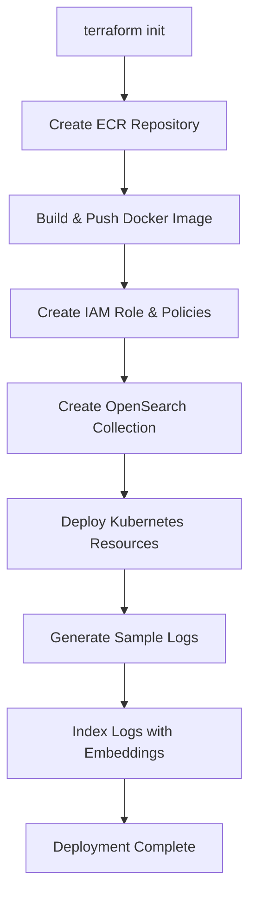

# Terraform Implementation Summary

## Overview

Complete automated deployment solution for the Advanced RAG on EKS application using Terraform Infrastructure as Code.

## What Was Implemented

### ✅ Root Module Files

- **`versions.tf`**: Terraform and provider version constraints
- **`providers.tf`**: AWS and Kubernetes provider configuration
- **`variables.tf`**: All input variables with defaults
- **`main.tf`**: Module orchestration and resource dependencies
- **`outputs.tf`**: Deployment outputs and test commands
- **`terraform.tfvars.example`**: Example configuration file
- **`.gitignore`**: Terraform-specific ignore patterns

### ✅ Module: IAM (`modules/iam/`)

**Purpose**: Create IAM policies and IRSA role for pod authentication

**Resources Created**:
- IAM Policy for Bedrock access (`eks-rag-bedrock-policy`)
- IAM Policy for OpenSearch access (`eks-rag-opensearch-policy`)
- IAM Role with OIDC trust policy (`eks-rag-sa-role-{cluster}`)
- Role policy attachments

**Key Features**:
- Uses EKS OIDC provider for IRSA
- Least-privilege policies
- Scoped to specific service account

### ✅ Module: OpenSearch (`modules/opensearch/`)

**Purpose**: Create OpenSearch Serverless collection and policies

**Resources Created**:
- Encryption policy (AWS-owned keys)
- Network policy (public or VPC access)
- Collection (`error-logs-mock`, VECTORSEARCH type)
- Data access policy (dynamically uses IAM role ARN)

**Key Features**:
- Proper resource ordering with dependencies
- Configurable public/private access
- Automatic policy generation

### ✅ Module: ECR (`modules/ecr/`)

**Purpose**: Create container registry for Docker images

**Resources Created**:
- ECR Repository (`advanced-rag-mloeks/eks-rag`)
- Lifecycle policy (keep last 10 images)

**Key Features**:
- Scan on push enabled
- Automatic image cleanup

### ✅ Module: Kubernetes (`modules/kubernetes/`)

**Purpose**: Deploy application to EKS cluster

**Resources Created**:
- ServiceAccount with IAM role annotation
- Deployment (2 replicas, health probes configured)
- Service (LoadBalancer type)
- NetworkPolicy (vLLM egress + AWS services)

**Key Features**:
- Environment variables for vLLM and OpenSearch
- Health checks (readiness + liveness)
- Network segmentation
- Resource limits

### ✅ Module: Data Indexing (`modules/data-indexing/`)

**Purpose**: Generate and index sample data

**Resources Created**:
- null_resource for Python dependencies
- null_resource for log generation
- null_resource for log indexing

**Key Features**:
- Automatic dependency installation
- ~1000 sample logs (7 days)
- Vector embeddings via Bedrock
- KNN index creation

### ✅ Deployment Scripts (`scripts/`)

#### `build-and-push.sh`
- ECR authentication
- Docker image build
- Image push to ECR
- Error handling

#### `index-logs.sh`
- Wrapper for Python indexing script
- Environment variable handling
- Progress reporting

### ✅ Documentation

- **`README.md`**: Complete documentation (60+ sections)
- **`QUICKSTART.md`**: Rapid deployment guide
- **`IMPLEMENTATION_SUMMARY.md`**: This file

## Deployment Flow



## Resource Dependencies

```
ECR Repository
    └── Docker Build & Push
            └── Kubernetes Deployment

IAM Role
    └── OpenSearch Collection
            ├── Data Access Policy
            └── Data Indexing

All above
    └── Service Ready
```

## Key Design Decisions

### 1. Circular Dependency Resolution
**Problem**: IAM policy needs OpenSearch ARN, OpenSearch access policy needs IAM role ARN

**Solution**:
- IAM policy uses wildcard for OpenSearch collections
- OpenSearch access policy references IAM role after creation
- Proper `depends_on` ensures correct order

### 2. Local Execution
**Choice**: Use `null_resource` with `local-exec` for Docker and Python

**Rationale**:
- Simplifies deployment (no separate CI/CD needed)
- Direct access to local Docker daemon
- Uses existing AWS credentials

**Trade-off**: Requires local tools (Docker, Python)

### 3. Module Granularity
**Approach**: Separate modules for each logical component

**Benefits**:
- Independent testing
- Reusable components
- Clear dependency graph
- Easier troubleshooting

### 4. Public OpenSearch (Default)
**Choice**: Allow public access to OpenSearch collection

**Rationale**:
- Simplifies initial deployment
- No VPC endpoint configuration needed
- Data access still controlled by IAM

**Production**: Should use VPC endpoints

### 5. State Management
**Current**: Local state file

**Production**: Should use S3 backend with DynamoDB locking

## Files Created

```
eks-rag/terraform/
├── versions.tf (17 lines)
├── providers.tf (23 lines)
├── variables.tf (97 lines)
├── main.tf (111 lines)
├── outputs.tf (57 lines)
├── terraform.tfvars.example (28 lines)
├── .gitignore (27 lines)
├── README.md (650+ lines)
├── QUICKSTART.md (200+ lines)
├── IMPLEMENTATION_SUMMARY.md (this file)
├── modules/
│   ├── iam/
│   │   ├── variables.tf (29 lines)
│   │   ├── main.tf (93 lines)
│   │   └── outputs.tf (20 lines)
│   ├── opensearch/
│   │   ├── variables.tf (24 lines)
│   │   ├── main.tf (99 lines)
│   │   └── outputs.tf (20 lines)
│   ├── ecr/
│   │   ├── variables.tf (29 lines)
│   │   ├── main.tf (40 lines)
│   │   └── outputs.tf (21 lines)
│   ├── kubernetes/
│   │   ├── variables.tf (57 lines)
│   │   ├── main.tf (180 lines)
│   │   └── outputs.tf (20 lines)
│   └── data-indexing/
│       ├── variables.tf (24 lines)
│       ├── main.tf (52 lines)
│       └── outputs.tf (11 lines)
└── scripts/
    ├── build-and-push.sh (50 lines)
    └── index-logs.sh (44 lines)
```

**Total**: 25 files, ~1,900+ lines of code

## Validation Checklist

Before deployment, verify:

- [ ] EKS cluster exists and is accessible
- [ ] vLLM service is running in vllm namespace
- [ ] AWS credentials are configured
- [ ] kubectl is configured for the cluster
- [ ] Docker daemon is running
- [ ] Python 3.9+ is installed
- [ ] pip is available
- [ ] Terraform >= 1.5.0 is installed

## Post-Deployment Verification

```bash
# 1. Check Terraform outputs
terraform output

# 2. Verify IAM role
aws iam get-role --role-name eks-rag-sa-role-trainium-inferentia

# 3. Verify OpenSearch collection
aws opensearchserverless list-collections --region us-west-2

# 4. Verify ECR repository
aws ecr describe-repositories --repository-names advanced-rag-mloeks/eks-rag

# 5. Verify Kubernetes resources
kubectl get sa eks-rag-sa -o yaml
kubectl get deployment eks-rag
kubectl get svc eks-rag-service
kubectl get networkpolicy allow-vllm-access

# 6. Check pod status
kubectl get pods -l app=eks-rag
kubectl logs -l app=eks-rag --tail=50

# 7. Test the service
export SERVICE_IP=$(terraform output -raw rag_service_endpoint)
curl http://$SERVICE_IP/health
```

## Cost Breakdown

**Monthly Costs (us-west-2)**:

| Service | Cost | Notes |
|---------|------|-------|
| OpenSearch Serverless | $100-200 | OCU-based, ~2-4 OCUs |
| Network Load Balancer | $18-20 | 1 NLB for service |
| ECR Storage | $1-5 | ~5-10 images |
| Bedrock API | $1-10 | Embedding generation |
| Data Transfer | $5-10 | Minimal |
| **Total** | **$125-245** | **Per month** |

**One-time costs**:
- Initial indexing: ~$1-2 (Bedrock API calls)

## Advantages Over Manual Deployment

| Aspect | Manual | Terraform |
|--------|--------|-----------|
| Time | 45-60 minutes | 15-25 minutes |
| Steps | 20+ manual steps | 1 command |
| Errors | High risk | Low risk |
| Reproducibility | Manual tracking | Automated |
| Updates | Re-run all steps | `terraform apply` |
| Cleanup | Manual deletion | `terraform destroy` |
| Documentation | Separate docs | Self-documenting |
| Version Control | Not tracked | Git-tracked |

## Known Limitations

1. **Local Docker**: Requires Docker installed locally
2. **Local Python**: Requires Python 3.9+ for indexing
3. **State Management**: Uses local state (should use S3 for teams)
4. **Image Tags**: Uses `:latest` (should use immutable tags in production)
5. **Public OpenSearch**: Default is public access (should use VPC endpoints)
6. **No Blue/Green**: Direct deployment (should support zero-downtime updates)
7. **No Monitoring**: Doesn't create CloudWatch dashboards
8. **No Backup**: Doesn't configure OpenSearch snapshots

## Future Enhancements

### Phase 2
- [ ] S3 backend for Terraform state
- [ ] VPC endpoint support for OpenSearch
- [ ] CloudWatch log groups and dashboards
- [ ] X-Ray tracing integration
- [ ] Custom metrics and alarms

### Phase 3
- [ ] Multi-region support
- [ ] Blue/green deployment strategy
- [ ] Horizontal Pod Autoscaler
- [ ] Pod Disruption Budgets
- [ ] Network policies for stricter egress

### Phase 4
- [ ] CI/CD integration (GitHub Actions)
- [ ] Automated testing
- [ ] Compliance scanning (tfsec, checkov)
- [ ] Cost optimization recommendations
- [ ] Disaster recovery automation

## Support

For issues:

1. **Terraform errors**: Check `terraform plan` output
2. **AWS errors**: Check AWS CloudTrail
3. **Kubernetes errors**: Check `kubectl describe` and logs
4. **Application errors**: Check pod logs

For questions:
- Review `README.md` for detailed documentation
- Check `QUICKSTART.md` for quick reference
- Refer to main repository documentation

## Success Criteria

Deployment is successful when:

1. ✅ All Terraform resources created without errors
2. ✅ OpenSearch collection status is ACTIVE
3. ✅ Kubernetes pods are Running and Ready (2/2)
4. ✅ LoadBalancer has external IP/hostname
5. ✅ Health endpoint returns 200 OK
6. ✅ Test query returns LLM response with similar documents
7. ✅ Pod logs show no errors

## Conclusion

This Terraform implementation provides:
- **Complete automation** of RAG service deployment
- **Production-ready** modular infrastructure code
- **Self-documenting** configuration
- **Reproducible** deployments across environments
- **Version-controlled** infrastructure
- **Easy cleanup** with single command

The implementation follows Terraform best practices and AWS Well-Architected Framework principles, making it suitable for both development and production use cases with appropriate modifications.
